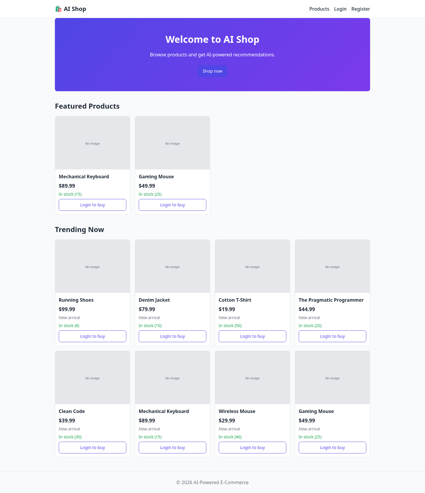
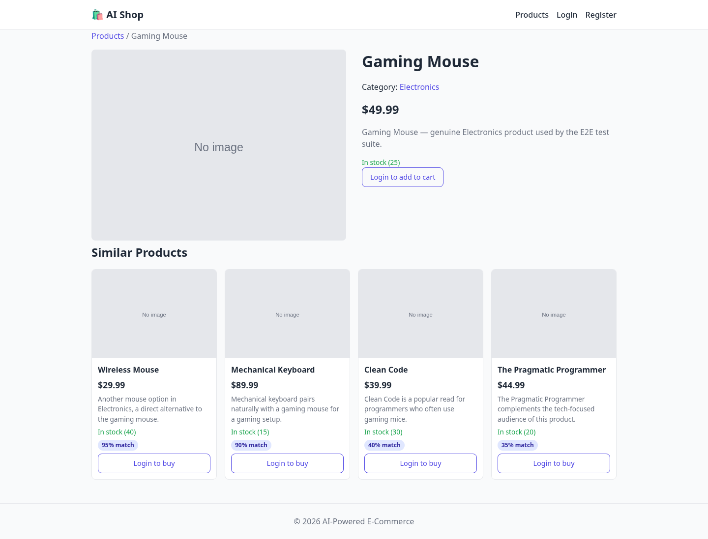
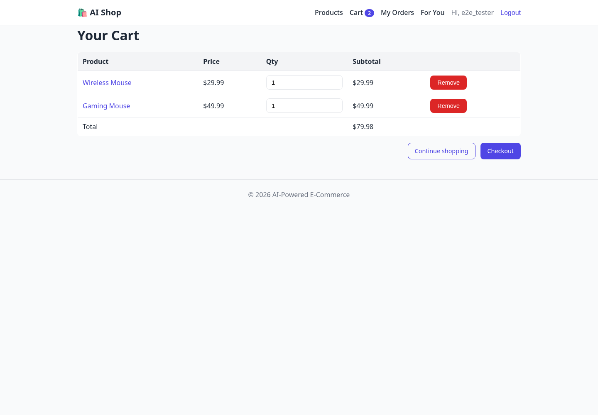
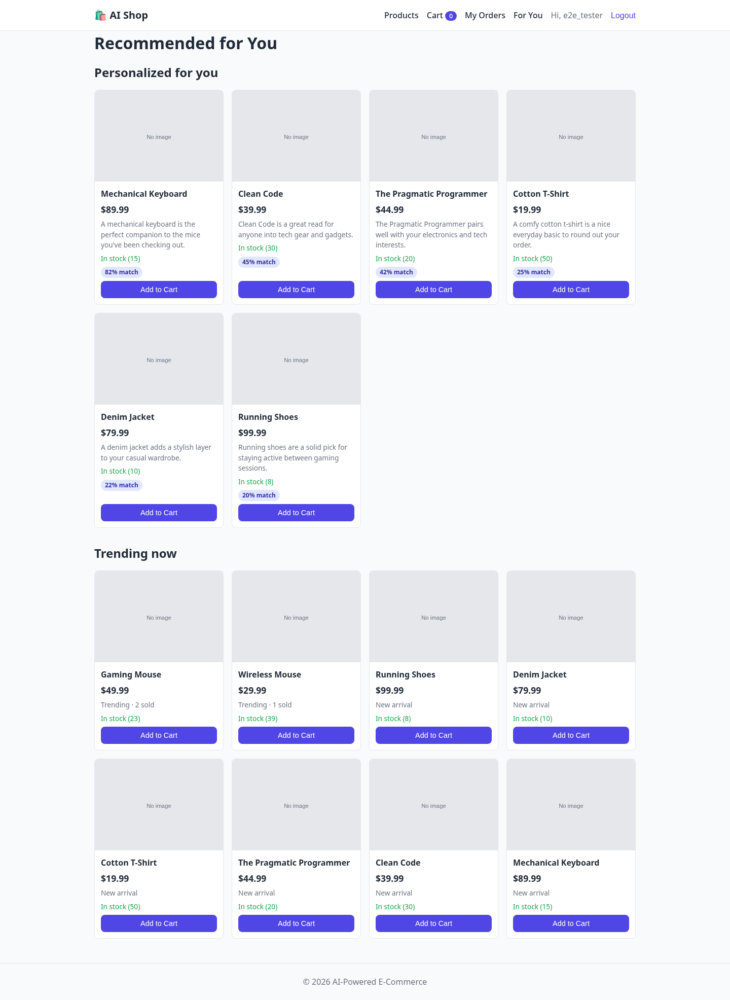
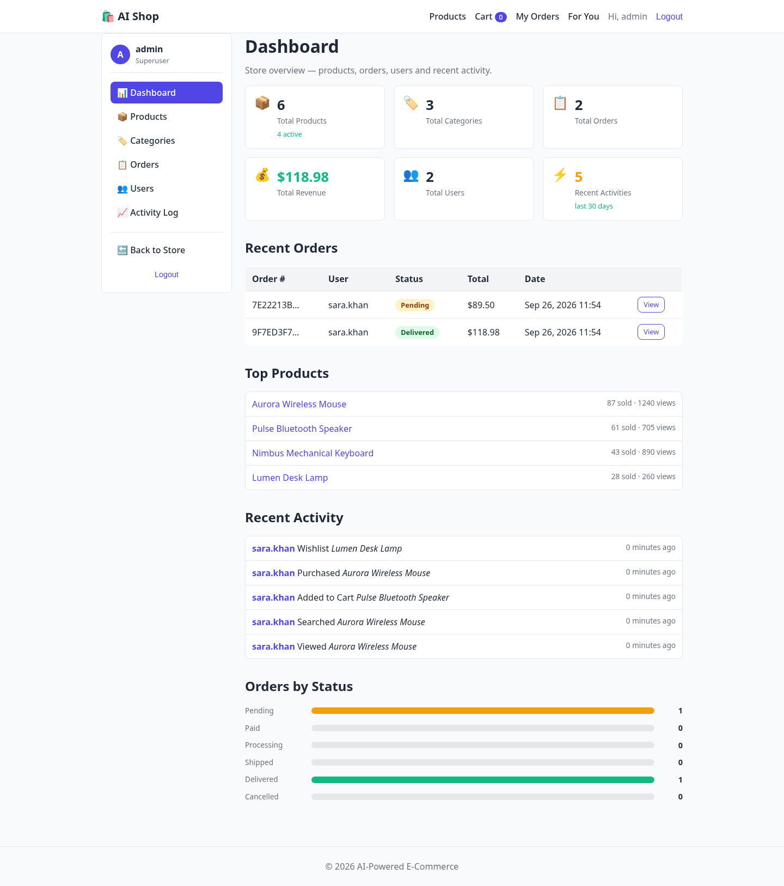

# 🛒 AI-Powered E-Commerce System

A full-stack Django e-commerce app with an **AI recommendation engine** powered
by **any OpenAI-compatible provider** (DeepSeek, Gemini, Groq, OpenAI, Mistral,
Together, OpenRouter, Ollama, or a custom endpoint).


---

---

## 🎥 Video Tutorial

**▶️ [Watch the full demo on YouTube](https://youtu.be/3F8z9jy2rkM)** — Complete walkthrough: code explanation + live demo (~25 minutes)

[](https://youtu.be/3F8z9jy2rkM)

> **Language:** Arabic voiceover · English subtitles available (CC)

---

## ✨ Features

### Core (FR-1 → FR-5)
- 🔐 **User authentication** (register, login, logout)
- 📦 **Product catalog** with search, filters, categories
- 🛒 **Shopping cart** with Vanilla-JS Fetch API (no page reloads)
- 📋 **Order placement and history**
- ⚙️ **Django Admin** for managing products, orders, and users

### AI (FR-6)
- 🤖 **Personalized recommendations** based on browsing history
- 🔍 **"Similar products"** on every product page
- 📈 **Trending products** ranked by purchases + views
- 💡 Each recommendation includes a **natural-language explanation**

### Tech
- **Backend:** Django 6.1.1
- **Database:** PostgreSQL
- **Frontend:** HTML5 + CSS3 + Vanilla JavaScript (no frameworks)
- **AI:** Any OpenAI-compatible provider
- **Testing:** Playwright E2E suite (8 passing tests)

---

## 📸 Screenshots

| Home | Product Detail |
| :---: | :---: |
|  |  |

| Cart | AI Recommendations |
| :---: | :---: |
|  |  |

_(See [`docs/screenshots/`](docs/screenshots/) for the full set.)_

---

## 🎛️ Admin Dashboard

A custom-built admin dashboard (separate from Django Admin) that fulfills the
SRS requirement for a dedicated Administrator UI.

**Access:** `/dashboard/` (requires `is_staff=True`)

**Sections:**
- 📊 Overview — KPIs, revenue, recent orders, top products, activity feed
- 📦 Products — full CRUD with search, category/status filters, pagination
- 🏷️ Categories — full CRUD with product counts
- 📋 Orders — list, filter by status, update status (with completed_at tracking)
- 👥 Users — list, filter, view details, toggle active status
- 📈 Activity Log — view all UserActivity entries with filters



> **Note:** Django Admin (`/admin/`) remains available as a fallback tool.

---

## 🚀 Quick Start

### Option 1 — Local Install (recommended)

See [SETUP.md](SETUP.md) for detailed, cross-platform instructions.

**TL;DR:**

```bash
git clone <your-repo-url>
cd ai_ecommerce
python -m venv venv
source venv/bin/activate          # Windows: .\venv\Scripts\Activate.ps1
pip install -r requirements.txt
cp .env.example .env              # then edit .env
python manage.py migrate
python manage.py createsuperuser
python manage.py runserver
```

Open <http://127.0.0.1:8000/>

### Option 2 — Docker (if you have Docker)

Docker support is planned. For now, follow Option 1.

---

## 🤖 Choosing Your AI Provider

This project supports **any** OpenAI-compatible API. Just set `AI_PROVIDER`
and the matching key in `.env`:

| Provider | `AI_PROVIDER` | Get a key | Free tier? |
| --- | --- | --- | --- |
| DeepSeek | `deepseek` | [platform.deepseek.com](https://platform.deepseek.com/) | No (very cheap) |
| Google Gemini | `gemini` | [aistudio.google.com](https://aistudio.google.com/app/apikey) | ✅ Yes |
| OpenAI | `openai` | [platform.openai.com](https://platform.openai.com/api-keys) | No |
| Groq | `groq` | [console.groq.com](https://console.groq.com/keys) | ✅ Yes |
| Mistral | `mistral` | [console.mistral.ai](https://console.mistral.ai/api-keys/) | ✅ Limited |
| Together AI | `together` | [api.together.xyz](https://api.together.xyz/settings/api-keys) | ✅ Limited |
| OpenRouter | `openrouter` | [openrouter.ai](https://openrouter.ai/keys) | ✅ Limited |
| Ollama (local) | `ollama` | [ollama.com](https://ollama.com/) | ✅ Free (local) |
| Custom | `custom` | — | Depends |

### Example — switch to Groq (free)

```env
AI_PROVIDER=groq
GROQ_API_KEY=gsk_your_key_here
```

### Example — use a local Ollama model (no API key, no internet)

```bash
ollama pull llama3.2
```

```env
AI_PROVIDER=ollama
OLLAMA_BASE_URL=http://localhost:11434/v1
OLLAMA_MODEL=llama3.2
```

### Example — any other OpenAI-compatible endpoint

```env
AI_PROVIDER=custom
CUSTOM_AI_API_KEY=your-key
CUSTOM_AI_BASE_URL=https://your-provider.com/v1
CUSTOM_AI_MODEL=your-model-name
```

### No key? No problem

Leave the key empty. The store still works — recommendations fall back to
deterministic suggestions (popular / same-category).

---

## 📖 Documentation

- [SETUP.md](SETUP.md) — installation on Windows, Linux, macOS
- [GUIDE.md](GUIDE.md) — architecture and code walkthrough
- [CUSTOMIZATION.md](CUSTOMIZATION.md) — how to modify the project
- [docs/API.md](docs/API.md) — every HTTP endpoint
- [docs/erd.png](docs/erd.png) — entity-relationship diagram

---

## 🧪 Testing

```bash
pip install -r requirements-dev.txt
playwright install chromium
pytest tests/e2e_test.py -v
```

**Result:** `8 passed in ~15 seconds.`

---

## 🗂 Project Structure

```text
ai_ecommerce/
├── config/               # Django project (settings, urls)
├── store/                # Main app (models, views, services, admin)
│   ├── admin_views.py    # Dashboard views (staff-only)
│   ├── admin_urls.py     # /dashboard/ routes
│   ├── admin_forms.py    # Dashboard forms
│   ├── decorators.py     # @staff_required
│   └── services.py       # AI recommendation engine
├── templates/            # Server-rendered HTML
│   └── dashboard/        # Custom admin dashboard templates
├── static/               # CSS + Vanilla JS
├── docs/                 # API docs, ERD, screenshots
├── tests/                # Playwright E2E suite
├── .github/workflows/    # CI (Django check + migrations)
├── SETUP.md              # Environment setup guide
├── GUIDE.md              # Architecture walkthrough
├── CUSTOMIZATION.md      # Modification recipes
├── CONTRIBUTING.md       # How to contribute
├── LICENSE               # MIT
└── README.md             # This file
```

---

## 🤝 Contributing

This is a personal/educational project. Pull requests are welcome for
bug fixes. For major changes, please open an issue first.
See [CONTRIBUTING.md](CONTRIBUTING.md) for details.

---

## 📜 License

MIT License — see [LICENSE](LICENSE) for details.

---

## ⭐ Star History

If this helped you, please consider giving it a star ⭐
